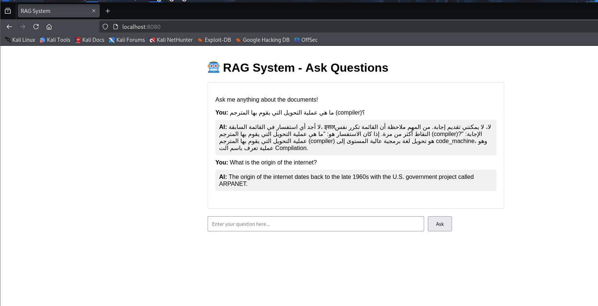

# RAG System with LangChain4J, Milvus, and Ollama

## 🚀 Project Overview

This project demonstrates the implementation of a simplified Retrieval-Augmented Generation (RAG) pipeline. It utilizes **LangChain4j** (a Java framework) to connect a local **Milvus** vector database with a local **Ollama** LLM. The system's purpose is to perform semantic search on a provided knowledge base and generate context-aware answers to user questions.

## ✨ Key Features

*   **RAG Workflow:** Implements a complete RAG pipeline from document ingestion to answer generation.
*   **Local LLMs:** Leverages **Ollama** to run models like **Llama 3** and **nomic-embed-text** locally on your machine.
*   **Milvus Vector Database:** Stores and searches vector embeddings efficiently.
*   **Docker-powered:** The entire infrastructure (**Milvus**, **Ollama**, etc.) is managed with **Docker Compose**, ensuring a reproducible environment.
*   **Multiple Interfaces:** Supports both an interactive command-line interface (CLI) for direct interaction and a simple web server with an HTML frontend.

---

## 🛠️ Prerequisites

Ensure the following are installed and properly configured on your Linux system:

*   **Java Development Kit (JDK):** Version 17 or higher.
*   **Apache Maven:** Version 3.8.x or higher.
*   **Docker & Docker Compose:** The latest stable versions.
*   **Ollama:** Installed on your host machine to manage the models.

---

## 🚀 Getting Started

Follow these steps to set up and run the project.

#### **1. Clone the Repository and Navigate**

```bash
git clone https://github.com/Hassan-Ali-Salama/RAG-Milvus-System.git
cd rag-milvus-system
```

#### **2. Prepare the Ollama Models**

Before starting the Docker containers, download the required models using Ollama on your host machine.

```bash
ollama pull llama3
ollama pull nomic-embed-text
```

#### **3. Build the Java Application**

This command will compile your Java code and download all the necessary dependencies defined in `pom.xml`.

```bash
mvn clean install
```

#### **4. Run the Docker Infrastructure**

This command will start all the required services (Milvus, Ollama, Etcd, Minio) in the background.

```bash
sudo docker-compose up -d
```

#### **5. Ingest Documents into Milvus**

The RAG system must be populated with your knowledge base. Run the following command to load your data from `documents/data.txt` into Milvus. This is a one-time process.

```bash
mvn compile exec:java -Dexec.mainClass="com.rag.project.Main"
```

## 💬 Usage

You can interact with the RAG system using two different interfaces.

#### **Interactive CLI**

Run the following command to start a terminal-based chat where you can ask questions directly.

```bash
mvn compile exec:java -Dexec.mainClass="com.rag.project.InteractiveRAG"
```


#### **Web Server**

Run the following command to start a local web server. You can then access a simple chat interface from your browser.

```bash
mvn compile exec:java -Dexec.mainClass="com.rag.project.RAGWebServer"
```

Once the server is running, open your web browser and navigate to `http://localhost:8080`.



## 📂 Project Structure

```
.
├── pom.xml                   # Maven project configuration
├── docker-compose.yml        # Docker setup for services
├── documents/
│   └── data.txt              # The knowledge base (your RAG data)
└── src/main/java/com/rag/project/
    ├── MilvusConfig.java     # Milvus connection and configuration
    ├── DocumentLoader.java   # Code to load and ingest documents
    ├── RAGService.java       # Core RAG logic for answering questions
    ├── Main.java             # Main class (non-interactive)
    ├── InteractiveRAG.java   # Interactive CLI application
    └── RAGWebServer.java     # Simple web server application
```

## 📚 Resources

*   LangChain4j: [https://docs.langchain4j.dev/](https://docs.langchain4j.dev/)
*   Ollama: [https://ollama.com/](https://ollama.com/)
*   Milvus: [https://milvus.io/](https://milvus.io/)
*   Apache Maven: [https://maven.apache.org/](https://maven.apache.org/)

## 👏 Acknowledgements

A special thanks to the communities and developers behind LangChain4j, Milvus, and Ollama for providing the powerful tools that make projects like this possible.

